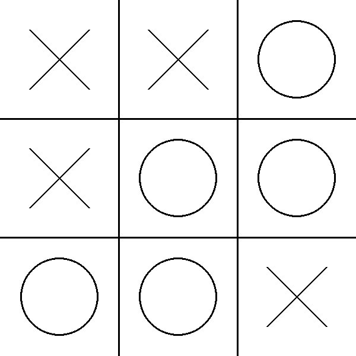

# Tic Tac Toe
A randomized Tic Tac Toe game written in Pygame, Python. This idea was taken from [The Coding Train](https://www.youtube.com/@TheCodingTrain).

## Setup
1. Install the required libraries: `pip3 install -r requirements.txt`
2. Run the main script: `python3 main.py`

## Screenshots

## License
This program is under the GPL-3.0 license. Read more about it [here](LICENSE)